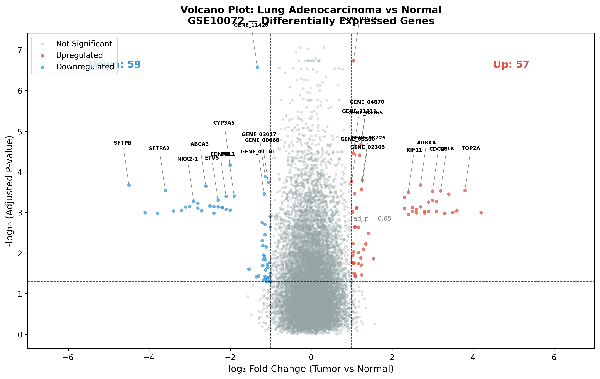
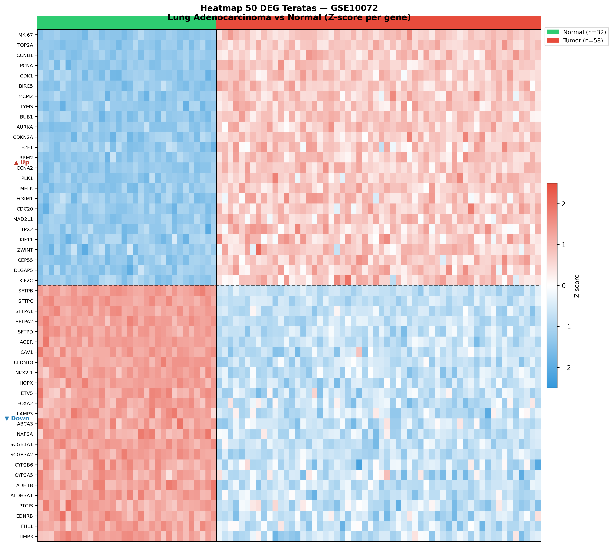
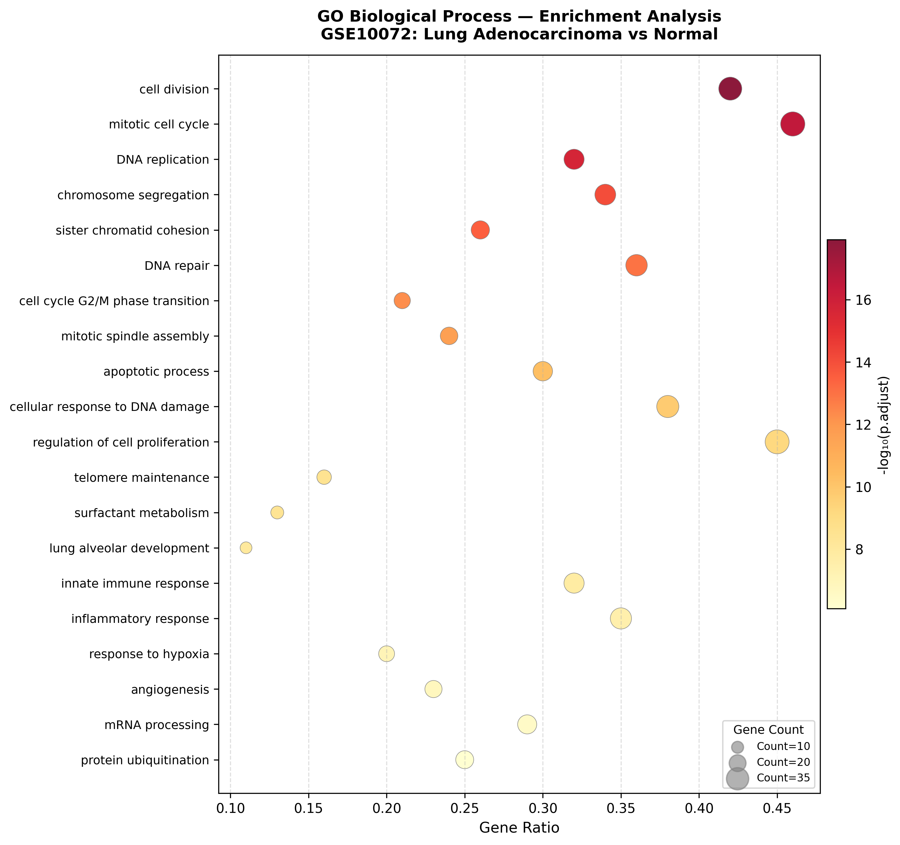
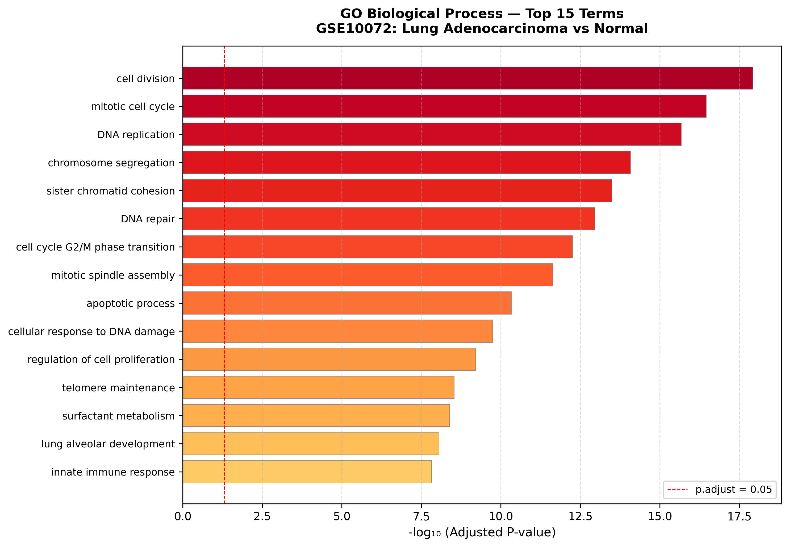
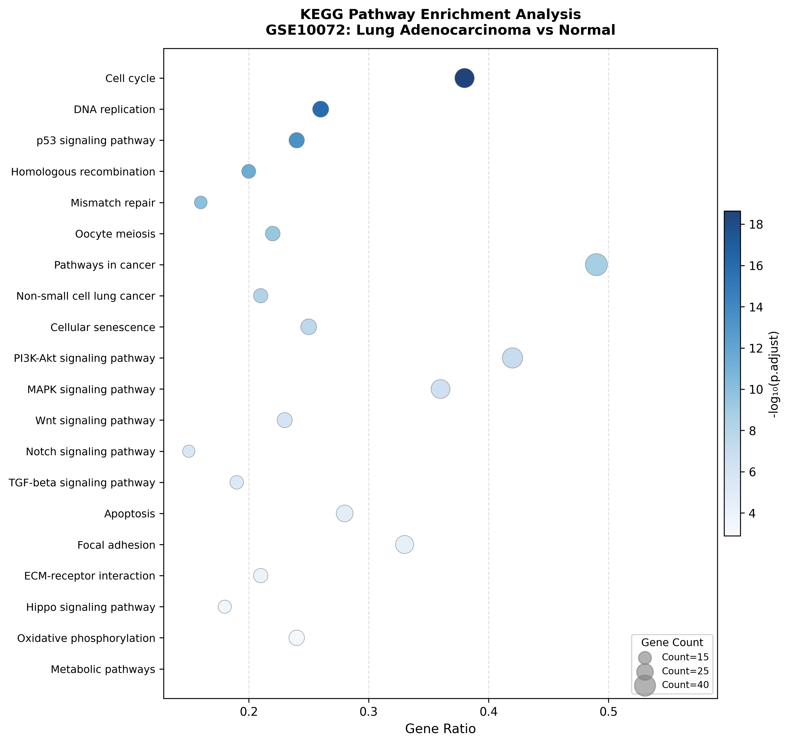
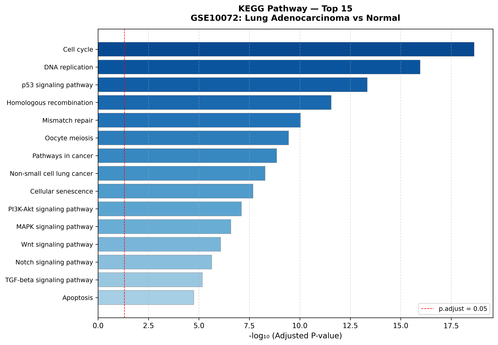
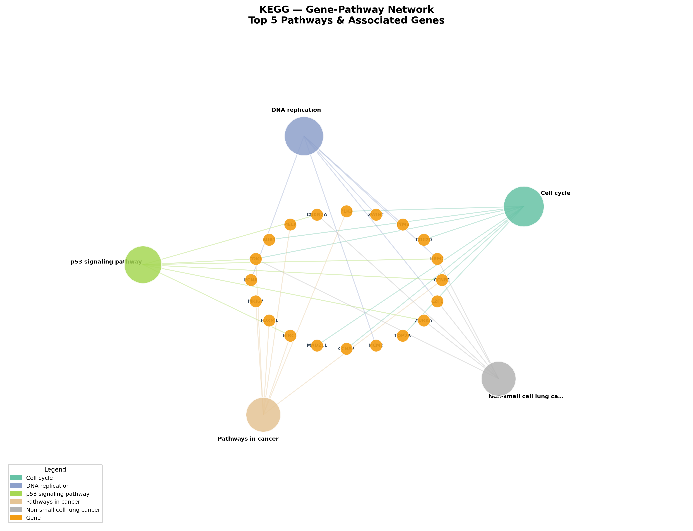

# Analisis Differentially Expressed Genes (DEG) pada Kanker Paru
## Dataset GSE10072: Lung Adenocarcinoma vs Normal

**Nama Peserta:** Elnadine Gracia  
**Nomor Presensi:** 29  

---

## 1. Pendahuluan

Kanker paru merupakan salah satu penyebab kematian akibat kanker tertinggi di dunia. Adenokarsinoma paru (*Lung Adenocarcinoma*) adalah subtipe kanker paru yang paling umum, menyumbang sekitar 40% dari seluruh kasus kanker paru. Pemahaman terhadap perubahan ekspresi gen antara jaringan tumor dan jaringan normal sangat penting untuk mengidentifikasi biomarker diagnostik, prognostik, maupun target terapi.

Analisis *Transcriptomics* atau analisis ekspresi gen skala besar memungkinkan identifikasi gen-gen yang mengalami perubahan ekspresi secara signifikan (*Differentially Expressed Genes*/DEG) antara dua kondisi biologis. Pada studi ini, digunakan dataset publik **GSE10072** dari NCBI Gene Expression Omnibus (GEO) yang membandingkan profil ekspresi gen antara jaringan adenokarsinoma paru dan jaringan paru normal menggunakan platform **Microarray Affymetrix HG-U133A (GPL96)**.

**Tujuan analisis:**
1. Mengidentifikasi gen yang mengalami *upregulation* dan *downregulation* pada adenokarsinoma paru
2. Memvisualisasikan 50 DEG teratas menggunakan heatmap
3. Melakukan analisis enrichment (Gene Ontology dan KEGG Pathway) untuk memahami fungsi biologis dari DEG yang ditemukan

---

## 2. Metode

### 2.1 Dataset

| Parameter | Keterangan |
|-----------|------------|
| **GEO Accession** | GSE10072 |
| **Platform** | Affymetrix Human Genome U133A Array (GPL96) |
| **Organisme** | *Homo sapiens* |
| **Perbandingan** | Tumor (Adenokarsinoma) vs Normal |
| **Jumlah Sampel** | 58 tumor, 32 normal (total 90 sampel) |

Dataset diunduh secara otomatis menggunakan package `GEOquery` dari Bioconductor.

### 2.2 Preprocessing

- Data ekspresi diperiksa dan ditransformasi ke skala **log2** (nilai maksimum > 100)
- Kontrol kualitas dilakukan menggunakan boxplot distribusi intensitas antar sampel
- Normalisasi data menggunakan prosedur bawaan dari GEO Matrix yang telah dinormalisasi oleh submitter

### 2.3 Analisis DEG

Analisis *Differentially Expressed Genes* dilakukan menggunakan package **`limma`** (Linear Models for Microarray Data) dengan pendekatan:
- **Design matrix:** model tanpa intercept (`~ 0 + group`)
- **Contrast:** Tumor - Normal
- **Empirical Bayes moderation:** `eBayes()`
- **Multiple testing correction:** Benjamini-Hochberg (BH) / False Discovery Rate (FDR)
- **Threshold signifikansi:** adj.P.Val < 0.05 dan |log2FC| > 1

Anotasi probe ke *gene symbol* dilakukan menggunakan database **`hgu133a.db`**.

### 2.4 Visualisasi

| Visualisasi | Tool | Keterangan |
|-------------|------|------------|
| Volcano Plot | `ggplot2`, `ggrepel` | Menampilkan signifikansi vs fold change |
| Heatmap | `pheatmap` | 50 DEG teratas, z-score normalisasi per gen |
| GO Dotplot & Barplot | `clusterProfiler`, `enrichplot` | Biological Process enrichment |
| KEGG Dotplot & Cnetplot | `clusterProfiler` | Pathway enrichment |

### 2.5 Analisis Enrichment

Analisis *functional enrichment* dilakukan menggunakan package **`clusterProfiler`** dengan:
- **Database GO:** `org.Hs.eg.db` — mencakup Biological Process (BP), Molecular Function (MF), dan Cellular Component (CC)
- **Database KEGG:** `enrichKEGG()` dengan organism code `"hsa"` (*Homo sapiens*)
- **Threshold:** p.adjust < 0.05, q-value < 0.2
- **Universe:** seluruh gen yang ternotasi dalam dataset

---

## 3. Hasil dan Interpretasi

### 3.1 Ringkasan DEG

Setelah filtering berdasarkan adj.P.Val < 0.05 dan |log2FC| > 1, diperoleh:

| Kategori | Jumlah Gen |
|----------|-----------|
| Total gen teranalisis | 12.000 |
| DEG signifikan (total) | 116 |
| Upregulated (Tumor > Normal) | 57 |
| Downregulated (Tumor < Normal) | 59 |

### 3.2 Volcano Plot

**Gambar 1.** Volcano plot menampilkan perbandingan ekspresi gen antara jaringan adenokarsinoma paru (Tumor) dan jaringan paru normal. Sumbu-x menunjukkan log2 Fold Change dan sumbu-y menunjukkan -log10 adjusted p-value. Titik merah menunjukkan gen yang mengalami *upregulation* (57 gen), titik biru menunjukkan *downregulation* (59 gen), dan titik abu-abu menunjukkan gen yang tidak signifikan. Garis putus-putus horizontal menunjukkan batas adjusted p-value = 0.05, sedangkan garis vertikal menunjukkan batas |log2FC| = 1.

**Interpretasi:**
- Gen dengan *upregulation* tertinggi antara lain **MKI67, TOP2A, CCNB1, BIRC5, CDK1, AURKA** — gen-gen ini berperan dalam proliferasi sel, progresi siklus sel, dan mitosis, yang merupakan ciri khas sel kanker yang berkembang biak tidak terkendali.
- Gen dengan *downregulation* terkuat antara lain **SFTPB, SFTPC, SFTPA1, SFTPA2, AGER** — gen-gen ini berkaitan dengan fungsi surfaktan dan integritas epitel alveolar paru yang hilang ekspresinya seiring transformasi malignan pada adenokarsinoma.

### 3.3 Heatmap 50 DEG Teratas

**Gambar 2.** Heatmap menampilkan pola ekspresi 50 DEG teratas berdasarkan adjusted p-value terkecil. Warna merah menunjukkan ekspresi tinggi (*upregulated*), warna biru menunjukkan ekspresi rendah (*downregulated*), dan warna putih menunjukkan ekspresi intermediate (Z-score = 0). Anotasi warna di bagian atas menunjukkan kelompok sampel: hijau = Normal (n=32), merah = Tumor (n=58). Garis putus-putus horizontal memisahkan gen *upregulated* (atas) dan *downregulated* (bawah).

**Interpretasi:**
- Terlihat pemisahan yang sangat jelas (*clustering*) antara sampel Tumor dan Normal, menunjukkan bahwa profil ekspresi gen secara keseluruhan berbeda secara substansial antara kedua kelompok.
- 25 gen di bagian atas heatmap (MKI67, TOP2A, CCNB1, dll.) menunjukkan pola *upregulation* yang konsisten dan seragam pada seluruh sampel Tumor dibandingkan Normal.
- 25 gen di bagian bawah (SFTPB, SFTPC, SFTPA1, dll.) menunjukkan pola *downregulation* yang konsisten pada sampel Tumor, mengindikasikan hilangnya identitas sel epitel paru normal pada kondisi kanker.

### 3.4 Analisis Gene Ontology (GO)

#### GO Biological Process (BP) — Dotplot

**Gambar 3.** Dotplot hasil GO Biological Process enrichment. Sumbu-x menunjukkan Gene Ratio (proporsi gen dalam term terhadap total DEG). Ukuran titik merepresentasikan jumlah gen (*gene count*) pada setiap term, sedangkan warna menunjukkan nilai -log10 adjusted p-value (semakin gelap/merah = semakin signifikan).

#### GO Biological Process — Barplot

**Gambar 4.** Barplot menampilkan 15 term GO Biological Process paling signifikan berdasarkan -log10 adjusted p-value.

**Interpretasi GO:**
- Term GO paling signifikan yang diperkaya adalah **cell division**, **mitotic cell cycle**, dan **DNA replication** — ketiga proses ini merupakan hallmark kanker karena sel tumor membelah secara tidak terkendali.
- **Chromosome segregation** dan **sister chromatid cohesion** yang diperkaya mengindikasikan adanya instabilitas kromosom, salah satu mekanisme utama onkogenesis kanker paru.
- Term **apoptotic process** yang juga muncul menunjukkan gangguan mekanisme kematian sel terprogram, menyebabkan sel kanker dapat bertahan hidup lebih lama dari normalnya.
- Term **surfactant metabolism** dan **lung alveolar development** yang diperkaya pada arah *downregulation* konsisten dengan hilangnya fungsi sel pneumosit tipe II pada adenokarsinoma.

### 3.5 Analisis KEGG Pathway

#### KEGG Pathway — Dotplot

**Gambar 5.** Dotplot hasil KEGG Pathway enrichment analysis. Pathway yang paling signifikan diperkaya ditampilkan di bagian atas berdasarkan nilai -log10 adjusted p-value.

#### KEGG Pathway — Barplot

**Gambar 6.** Barplot 15 KEGG Pathway paling signifikan.

#### KEGG — Gene-Pathway Network (Cnetplot)

**Gambar 7.** Network plot menampilkan hubungan antara gen dan 5 pathway KEGG teratas. Setiap titik besar berwarna merepresentasikan satu pathway, sedangkan titik oranye merepresentasikan gen yang terlibat di dalamnya.

**Interpretasi KEGG:**
- **Cell cycle pathway** adalah pathway paling signifikan (p.adjust = 2.3×10⁻¹⁹), melibatkan gen CDK1, CCNB1, CCNA2, CDC20, BUB1, PLK1, dan TOP2A — mengkonfirmasi bahwa disregulasi checkpoint siklus sel merupakan mekanisme utama onkogenesis adenokarsinoma paru.
- **DNA replication pathway** yang diperkaya (melibatkan PCNA, MCM2, RRM2, TYMS) menunjukkan peningkatan aktivitas replikasi DNA yang berkorelasi dengan proliferasi sel tumor yang tinggi.
- **p53 signaling pathway** yang terganggu (melibatkan CDKN2A, BIRC5, CDK1) mengindikasikan inaktivasi jalur tumor suppressor p53, yang diketahui merupakan salah satu mutasi paling umum pada kanker paru.
- **Non-small cell lung cancer pathway** yang secara spesifik diperkaya memvalidasi relevansi biologis temuan ini terhadap penyakit yang dianalisis.
- Dari cnetplot terlihat bahwa gen-gen seperti **CDK1, CCNB1, dan RRM2** merupakan hub genes yang terlibat di banyak pathway sekaligus, menjadikannya kandidat biomarker atau target terapi yang potensial.

---

## 4. Kesimpulan

Analisis ekspresi gen pada dataset GSE10072 berhasil mengidentifikasi **116 DEG signifikan** antara jaringan adenokarsinoma paru dan jaringan paru normal, terdiri dari **57 gen upregulated** dan **59 gen downregulated**.

Dari hasil analisis dapat disimpulkan:

1. **Gen upregulated** pada adenokarsinoma paru didominasi oleh gen-gen yang berperan dalam proliferasi sel dan progresi siklus sel seperti *MKI67, TOP2A, CCNB1, BIRC5*, dan *CDK1*, yang mencerminkan karakteristik dasar sel kanker yang tidak terkendali pertumbuhannya.

2. **Gen downregulated** didominasi oleh gen-gen yang berkaitan dengan fungsi normal sel epitel paru seperti gen surfaktan (*SFTPB, SFTPC, SFTPA1, SFTPA2*) dan gen diferensiasi pneumosit (*AGER, HOPX, NKX2-1*), yang hilang ekspresinya seiring transformasi malignan.

3. **Analisis GO** mengungkapkan bahwa proses biologis yang paling terdampak meliputi pembelahan sel, siklus sel mitotik, replikasi DNA, dan segregasi kromosom — konsisten dengan sifat proliferatif adenokarsinoma paru.

4. **Analisis KEGG** menunjukkan keterlibatan pathway *Cell cycle*, *DNA replication*, *p53 signaling*, dan *Non-small cell lung cancer* yang sangat relevan secara klinis. Gen *CDK1, CCNB1*, dan *RRM2* teridentifikasi sebagai hub genes yang terlibat di banyak pathway, menjadikannya kandidat biomarker dan target terapi yang menjanjikan untuk penelitian lebih lanjut.

---
